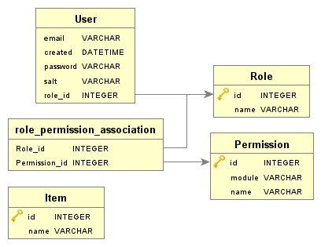

{:toc}
# CS351 authentication demo
David Kotaev

## Installation
1. Install requirements through apt, python > 3.8 (requires dataclasses for user serialization)
```
sudo apt install python3 python3-pip python3-flask
```
2. Install python package requirements.
```
python3 -m pip install -r requirements.txt
```
3. Make `scripts` executable.
```
chmod -R u+r+x ./scripts
```
4. Run `setup_tables.py` to create tables.
```
./scripts/setup_tables.py
```
5. Run flask app (from top level directory!)
```
./scripts/run.sh
```

## What? Why?
This is a small, barebones Python web application that uses [Flask](https://flask.palletsprojects.com/en/1.1.x/), [SQLAlchemy](https://docs.sqlalchemy.org/en/13/) to implement a form of user access control using a system with a hybrid of two systems - ACLs (Access Control Lists) and RBAC (Role Based Access Control).

An ACL is typically used in Linux filesystems for controlling access to files by specifying different levels that Users, Groups, and Owner have to Read, Write, and Execute files. See [this RedHat tutorial](https://www.redhat.com/sysadmin/linux-access-control-lists) for more info.

RBAC typically concerns itself with the actions that various Users will do under a Role - Users can have one or many Roles, and each Role can have many Permissions.

This hybrid approach uses the User/Role/Permissions modeling of RBAC, but has the Permissions be very similar to an ACL - instead of the verbs being 'Read', 'Write', and 'Execute', these are changed to 'Create', 'Read', 'Update', 'Delete', to fit the HTTP verbs.

This approach is chosen for its ease of integration with the traditional web app model of having "Users with Roles that have Permissions to do to Stuff" - this system uses those 3 models, `User`, `Role`, and `Permission`, to provide access control for the "Stuff" - our sole "business logic" entity, `Item`.

## Implementation
### Models and folder structure


The `core/entity/` folder contains each of the 4 entities. Common imports in `core/entity/common.py`. Entities are loaded into the Flask webapp through `core/entity/__init__.py`'s entity list:

```
__all__ = [
  'Permission',
  'Role',
  'User',
  # logic entities
  'Item'
]
```

... and loaded into a global `entity` dict in `core/__init__.py`. The entity dict is one of class names to class references:
```
{'Item': <class 'core.entity.Item.Item'>,
 'Permission': <class 'core.entity.Permission.Permission'>,
 'Role': <class 'core.entity.Role.Role'>,
 'User': <class 'core.entity.User.User'>}
```
The database globals `__all__ = ['session', 'meta', 'engine', 'entity']` are defined in the same `core/__init__.py`, and imported by the Flask app during its configuration in `flask_app/__init__.py`. `session`, `meta`, and `engine` are all SQLAlchemy globals, used in combination with the entity dict, e.g.

```
# get items
session.query(entity['Item']).all()

# create table
meta.tables['Role'].create(engine)
```

Otherwise, refer to Flask app folder structure and Blueprints. and SQLAlchemy documentation for use of the `session` and the declarative ORM extension used when defining the models.

### User
`core/entity/User.py`

A basic user class. Passwords are stored as hex string digests of a pbkdf2_hmac 64-byte hash, with 100,000 iterations. See [hashlib](https://docs.python.org/3.8/library/hashlib.html). The hashing and verifying are exposed public via the `login(email, password)` and `register(email, password)` methods.

To keep things simple, `User` has a 1:1 relationship to `Role` - a user can only have one role, e.g. 'Admin', 'User', 'Visitor'.


### Permission
`core/entity/Permission.py`

Simple model with id, module, and permission name. `module` refers to the entity , like `Item` in permission `Item.read`. The full set of Permissions is created as the Cartesian product (also known as a Cross Join) of CRUD verbs and the business logic entites in the `entity` dict:

`scripts/setup_tables.py`
```
# basically all permissions are just cross join of Entity X CRUD - because this is just for objects like an ACL
crud = ['create', 'read', 'update', 'delete']
permissions = [entity['Permission'](module=entity_name, name=operation) for entity_name, operation in product(entity.keys(), crud)]
session.add_all(permissions)
```
With our single `Item` entity, this results in the permissions `Item.read`, `Item.create`, `Item.update`, and `Item.delete`.

### Role
`core/entity/Role.py`

Simple model with id and name. Roles can have many Permissions (and vice-versa), which necessitates the use of a junction table: `role_permission_association`.

In `scripts/setup_tables.py`, 3 distinct roles are created for demonstration purposes.

- Admin
  - CRUD for all business logic entities (`Item`)
  - CRUD for Users/Roles/Permissions
    - Assigning Users their Roles
    - Making new Roles.
    - Deleting Roles
- User
  - CRUD for all business logic
- Visitor
  - Read-only for business logic (can't delete or update)

### Item
`core/entity/Item.py`

Very simple string collection. In `scripts/setup.py`, all the Items are created from 50 words of generated Lorem Ipsum, the famous placeholder text.

```
# dummy items from lorem ipsum
lorem = '''
Lorem ipsum dolor sit amet, consectetur adipiscing elit. Etiam pellentesque mauris leo, vitae placerat felis lacinia sit amet. Maecenas ultrices dapibus purus, eu feugiat leo molestie a. Curabitur sed nibh id arcu tincidunt tempor quis eget felis. Nunc varius, turpis ac dignissim placerat, felis diam dapibus nisl, at eleifend neque. 
'''
items = [entity['Item'](name = word) for word in lorem.split()]
session.add_all(items)
session.commit()`
```

### Model serialization for use in templates

Python's `dataclasses` module, available since 3.8, means that models can be decorated with the `@dataclass` decorator to be automatically JSON-serializable. The JSON-serializable models can then be serialized and stored in the Flask web session, which is available in templates. This allows for such Jinja2 templating expressions like:

```




  {# Admin only buttons and content here! #}

```
In theory, this would be used to only display action buttons, like those used to update and delete `Item`s - for this demonstrative project, those buttons are left in so that the custom 401 error page can be demonstrated.

### `/flask_app/access_control.py` - The meat and potatoes

Models having been defined, the allow/deny functionality is defined using decorators:

First, from the Flask examples, `login_required`, which looks for our serialized `User` object which is saved when we login (`flask_app/auth/auth.py`, function `login`).
```
def login_required(view):
  """View decorator that redirects anonymous users to the login page."""
  @functools.wraps(view)
  def wrapped_view(**kwargs):
    if 'User' not in web_session:
      return redirect(url_for('auth.login'))
    return view(**kwargs)
  return wrapped_view
```

Then, the most important decorator, `requires_permission`, which queries our database and checks if the User global has the correct permissions. If permissions are insufficient, we `abort(401)`, providing the request Permission for the custom error handler. `requires_permission` uses `login_required` - so not being logged in will be implicity denied.
```
def requires_permission(module_name, permission_name):
  error_code = 401
  def decorator(view):
    @functools.wraps(view)
    # also require login
    @login_required
    def wrapped_view(*args, **kwargs):
      # authenticate here - get permission from db
      #pdb.set_trace()
      permission = session.query(entity['Permission']).filter_by(module=module_name, name=permission_name).scalar()
      user = web_session['User']
      # user Role/Permissions are serialized - check that id for permission exists 
      ids = [perm['id'] for perm in user['Role']['Permissions']]
      #pdb.set_trace()
      if permission.id in ids:
        return view(*args, **kwargs)
      else:
        abort(error_code, {
          'permission': permission
        })
    return wrapped_view
  return decorator
```

The decorator 'wraps' a function, in a similar way to many other Flask utilites, like `bp.route` for Blueprint routing. What does this mean? Simply put, this authentication code is called before the request function. It's important that `require_permission` is **after** `bp.route()`, so that the authentication is actually called before the naked function.

`flask_app/item/item.py`
```
@bp.route('/items/', methods=['GET'])
@requires_permission('Item', 'read')
def show():
  singleton = lambda item: redirect(url_for('item.part_detail', id = item.id))
  return show_table(
    entity['Item'],
    translator,
    bp, singleton,
  )
```

### Fancy tables

The previous `show` method (used in the Role, User, and Item pages) uses utility code in `ViewUtil/ViewUtil.py`.
